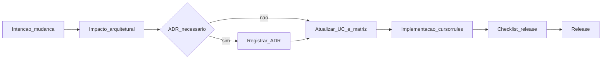

# Modelo de governança de releases

## Objetivo

Garantir que **cada release** tenha avaliação de impacto, rastreabilidade (negócio → aplicação → dados → tecnologia), ADR quando apropriado e **checklist de conformidade** antes do merge/release.

## Papéis (podem ser a mesma pessoa em time pequeno)

| Papel | Responsabilidade |
|-------|------------------|
| **Autor da mudança** | Descreve impacto, atualiza UC/matriz, abre ADR se necessário |
| **Revisor** | Valida checklist e consistência documental |
| **Release owner** | Aprova release após checklist verde |

## Ciclo por release

1. **Intenção** — história/épico ligado a um [caso de uso](../04-application-architecture/use-cases.md) (existente ou novo).  
2. **Avaliação de impacto arquitetural** — preencher seção “Impacto” (abaixo).  
3. **ADR?** — se mudança relevante (stack, integração, modelo de dados, segurança), criar `docs/adr/NNNN-*.md`.  
4. **Atualização de artefatos** — `traceability-matrix.md`, `data-entities.md` / `domain-model.md` se dados mudarem; `integration-patterns.md` se integração mudar.  
5. **Implementação** — conforme [`.cursorrules`](../../.cursorrules).  
6. **Checklist** — [architecture-review-checklist.md](architecture-review-checklist.md).  
7. **Release** — nota de release referenciando ADRs e UCs tocados.

## Avaliação de impacto arquitetural (template curto)

Copiar para a descrição do PR ou issue de release:

```text
## Impacto arquitetural
- Negócio: [nenhum / baixo / médio / alto] — justificativa:
- Aplicação (serviços/UCS): [lista UC-IDs]
- Dados: [nenhum / migration / novo agregado] — refs:
- Tecnologia: [nenhum / nova lib / novo container / nova fila]
- Integração Node ↔ Python: [não / sim — contrato alterado em shared-types: sim/não]
- Segurança/Privacidade: [nenhum / revisão necessária]
```

## Quando um ADR é obrigatório

- Nova dependência de infraestrutura (ex.: trocar biblioteca de fila).  
- Mudança de padrão de integração (sync → assíncrono, novo canal).  
- Alteração relevante em modelo de dados (novo agregado, quebra de compatibilidade).  
- Decisão de segurança (modelo de token, exposição de API).

## Quando o ADR pode ser dispensado (com registro no PR)

- Correção de bug sem mudança de contrato.  
- Refatoração interna preservando comportamento e contratos.  
- Ajustes de documentação.

## Versionamento da baseline documental

- Incrementar **Versão da baseline** em [docs/README.md](../README.md) quando houver mudança estrutural acordada (ex.: novo bounded context).  
- Revisar [`.cursorrules`](../../.cursorrules) quando limites entre camadas ou serviços mudarem (ver [cursorrules-standards.md](../07-standards/cursorrules-standards.md)).

## Fluxo visual


