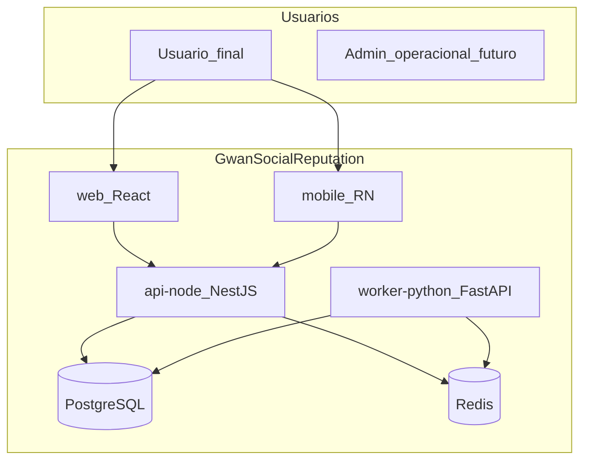

# Visão de arquitetura

## Objetivo

Descrever a visão técnica de **Gwan Social Reputation** (monorepo **gwan-social**): reputação social inspirada no conceito de “Nosedive”, com **cadastro**, **perfis**, **interações**, **avaliações**, **reputação** (global e contextual), **histórico de score**, e evolução futura para **denúncias/apelações** e processamento **antifraude/ranking/moderação** via worker Python.

A **definição funcional** (problema, atores, módulos, princípios de reputação) está em [application-definition.md](application-definition.md).

## Drivers de arquitetura

| Driver | Implicação |
|--------|------------|
| Separação domínio / infra | Clean Architecture + SOLID |
| Carga assimétrica (cálculo pesado) | Jobs assíncronos; Python como motor de processamento |
| Múltiplos clientes (web + mobile) | API versionada; tipos compartilhados |
| Rastreabilidade e governança | ADRs, matriz, UCs, checklist por release |
| Consistência de reputação | Transações no PostgreSQL + projeções/snapshots com eventual consistency onde aceitável |

## Qualidades-alvo

- **Manutenibilidade:** limites claros entre `api-node`, `worker-python`, `web`, `mobile`.  
- **Evoluibilidade:** novos contextos de reputação e regras no worker sem reescrever clientes.  
- **Auditabilidade:** histórico de score e decisões documentadas (ADRs).  
- **Segurança em camadas:** autenticação na API; princípio do menor privilégio em workers.

## Decisões arquiteturais com trade-offs

### 1) Cálculo de reputação: API síncrona mínima vs apenas assíncrono

| Opção | Prós | Contras |
|-------|------|---------|
| **A — Recomendada:** escrita de fatos na API (ex.: rating) síncrona; **recálculo** assíncrono no Python | Resposta rápida ao usuário; escala o processamento | Score exibido pode estar “em atualização” |
| B — Tudo síncrono na API | Leitura sempre atualizada na resposta | Latência e acoplamento de regras pesadas ao Nest |
| C — Tudo assíncrono inclusive gravação de fatos | Picos absorvidos | Complexidade UX e consistência para o usuário |

**Recomendação:** **A** — alinhada a filas Redis e worker Python; a API pode retornar snapshot atual ou indicador de processamento conforme [use-cases.md](../04-application-architecture/use-cases.md).

### 2) Fila: BullMQ (Node) + consumidor Python vs Redis Streams nativo

| Opção | Prós | Contras |
|-------|------|---------|
| **A — Recomendada:** **BullMQ** no `api-node` para produtor; **worker Python** consome via padrão acordado (bridge: script Node leitor ou **Redis Streams** como transport comum) | Ecossistema maduro no Node; retries; métricas | Dois runtimes exigem **contrato de mensagem** rigoroso em `shared-types` |
| B — Apenas Redis Streams em ambos | Menos dependências de alto nível | Mais código manual de consumo/retry |
| C — Fila externa (SQS/Rabbit) | Durabilidade forte | Custo e ops; ADR para introduzir |

**Recomendação inicial:** **BullMQ** para orquestração no lado Node; **payload JSON versionado** (`schema_version`) documentado em [integration-patterns.md](../04-application-architecture/integration-patterns.md). Se o consumidor Python não usar BullMQ diretamente, usar **lista/stream compatível** ou micro-adaptador documentado — detalhe na **implementação** com ADR quando for decidido.

### 3) Tipos compartilhados TypeScript ↔ Python

| Opção | Prós | Contras |
|-------|------|---------|
| **A — Recomendada:** `packages/shared-types` como fonte TS; Python valida com Pydantic espelhando contratos na documentação | Single source em TS; DX forte no front | Sincronização manual ou geração futura |
| B — JSON Schema gerado como fonte única | Linguagem neutra | Tooling extra no MVP |

**Recomendação:** **A** no MVP; evoluir para geração de schema se divergência se tornar problema (ADR).

### 4) Autenticação: JWT emitido pela API vs OIDC externo

| Opção | Prós | Contras |
|-------|------|---------|
| **A — Recomendada:** **JWT** (access/refresh) emitido pelo `api-node` no MVP | Simples, controle total | Responsabilidade de segurança na API |
| B — OIDC (Keycloak/Auth0/Cognito) | SSO e políticas centralizadas | Infra e config adicionais |

**Recomendação:** **A** para MVP; migrar para **B** com ADR se o produto exigir SSO.

## Visão de contexto (C4 nível 1)

## Relação com outros documentos

- Capacidades: [business-capabilities.md](../02-business-architecture/business-capabilities.md)  
- Integração: [integration-patterns.md](../04-application-architecture/integration-patterns.md)  
- Riscos: [risk-assumptions-constraints.md](../00-governance/risk-assumptions-constraints.md)
