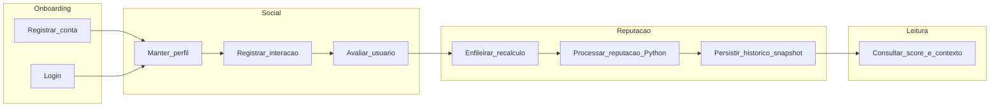

# Visão de processos de negócio (alto nível)

## Objetivo

Descrever o fluxo **cadastro → interação → avaliação → recálculo de reputação → leitura de score** para **Gwan Social Reputation**, sem detalhar implementação. Contexto de produto: [application-definition.md](../01-architecture-vision/application-definition.md).

## Fluxo principal

## Descrição resumida

1. **Onboarding:** usuário cria credenciais e sessão; perfil inicial disponível.  
2. **Social:** usuários mantêm perfil e registram interações permitidas pelo produto.  
3. **Avaliação:** uma parte avalia outra segundo regras (ex.: após interação válida — detalhe no UC).  
4. **Reputação:** evento de domínio dispara job; **worker Python** calcula scores e persiste snapshot/histórico.  
5. **Leitura:** clientes consultam API para exibir reputação e histórico conforme permissões.

## Processos futuros (não-MVP)

- **Moderação:** denúncia → fila → decisão → possível apelação (ver UC planejado em [use-cases.md](../04-application-architecture/use-cases.md)).

## Documentos relacionados

- [domain-model.md](../03-data-architecture/domain-model.md)  
- [use-cases.md](../04-application-architecture/use-cases.md)
