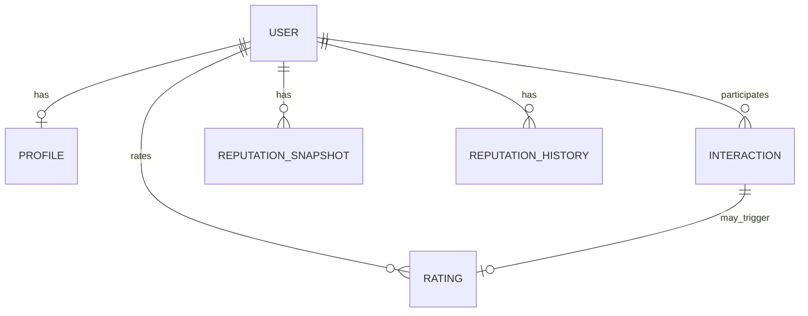

# Modelo de domínio (conceitual)

## Objetivo

Definir **agregados e linguagem ubíqua** para reputação social, alinhados a PostgreSQL e aos casos de uso, sem amarrar a nomes exatos de colunas (detalhes em [data-entities.md](data-entities.md)).

## Linguagem ubíqua (termos)

| Termo | Significado |
|-------|-------------|
| **Usuário** | Conta autenticável na plataforma. |
| **Perfil** | Informações exibidas e atributos públicos/privados do usuário. |
| **Interação** | Evento social entre usuários (tipo definido pelo produto). |
| **Avaliação (Rating)** | Julgamento de um usuário sobre outro, sujeita a regras. |
| **Reputação** | Score derivado (global e/ou por contexto). |
| **Snapshot** | Valor materializado de reputação em um instante. |
| **Histórico** | Série temporal de valores para auditoria e UI. |
| **Contexto** | Dimensão da reputação (ex.: categoria, tipo de interação) — evolutivo. |

## Agregados principais

### User (Identidade)

- **Raiz:** `UserId`  
- **Invariantes (exemplos):** email único; estado da conta (ativo/suspenso — futuro).  
- **Relaciona-se com:** `Profile` (1:1).

### Profile

- **Raiz:** vinculada ao `User`  
- **Dados:** apelido, bio, avatar (referência), preferências.

### Interaction

- **Raiz:** `InteractionId`  
- **Participantes:** `fromUser`, `toUser`, tipo, timestamps.  
- **Invariantes:** definidos por política de produto (ex.: não duplicar no mesmo intervalo — UC).

### Rating

- **Raiz:** `RatingId`  
- **Liga:** avaliador → avaliado; opcionalmente a `Interaction`.  
- **Invariantes:** limites de nota; janela de tempo; uma avaliação por par+contexto se aplicável.

### ReputationSnapshot / ReputationHistory

- **Snapshot:** leitura rápida do valor atual por usuário e contexto.  
- **Histórico:** append-only lógico para auditoria e gráficos.  
- **Nota:** cálculo **não** precisa ser transacional com cada `Rating` — ver consistência em [data-lifecycle.md](data-lifecycle.md).

### Report / Appeal (stub futuro)

- Entidades reservadas para moderação; **sem** fluxo completo no MVP.

## Diagrama de relacionamento conceitual

## Relação com camadas

- **Domínio:** entidades e políticas puras.  
- **Persistência:** mapeamento em infra; migrations versionadas (ver [database-standards.md](../07-standards/database-standards.md)).
