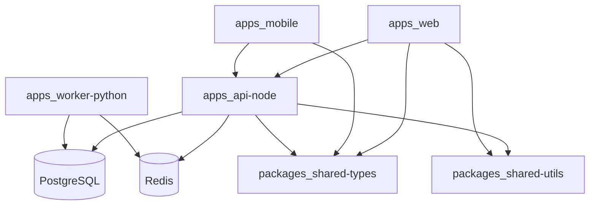

# Componentes da aplicação

## Objetivo

Descrever **aplicações**, **pacotes compartilhados** e **bounded contexts lógicos** no monorepo (**npm workspaces** na raiz; **pnpm** opcional), alinhados aos **módulos de produto** em [application-definition.md](../01-architecture-vision/application-definition.md).

## Estado atual vs alvo

| | Estado atual (as-is) | Alvo |
|--|----------------------|------|
| **`apps/web`** | Implementada: UI social com **mocks**, auth em **`localStorage`**, sem chamadas HTTP à API | Consome `/v1`; sem lógica de negócio duplicada para reputação |
| **`apps/api-node`**, **`apps/worker-python`**, **`apps/mobile`** | Não existem no repositório | Conforme fases M1–M5 |
| **`packages/shared-types`**, **`packages/shared-utils`** | Opcional / vazio | Contratos e utilitários partilhados |
| **Integração** | Nenhuma fila, DB nem Redis no projeto | API ↔ Redis ↔ worker ↔ PostgreSQL |

## Módulos de produto vs entrega (referência)

| Módulo de produto | Bounded context / entrega principal |
|-------------------|--------------------------------------|
| Identity & Access | Contexto Identity; `api-node` + DB |
| User Profile | Contexto Profile; `api-node` + DB |
| Interactions | Contexto Social/interações; `api-node` + DB |
| Ratings | Contexto Rating; `api-node` + DB |
| Reputation | Contexto Reputation; `worker-python` (cálculo), `api-node` (leitura), DB |
| Administration | Superfícies `web` (e APIs com papel admin); evolução futura de políticas |
| Notifications | `api-node` + canais (evolutivo) |
| Moderation / Appeals | API + worker (futuro) |
| Analytics / Processing | `worker-python`, filas, métricas |

## Mapa de componentes

| Componente | Tecnologia | Responsabilidade principal |
|------------|------------|----------------------------|
| `apps/api-node` | NestJS | HTTP API, autenticação, casos de uso, persistência transacional, publicação em fila |
| `apps/worker-python` | FastAPI + workers | Consumo de fila, cálculo de reputação, antifraude/ranking/moderação assíncrona |
| `apps/web` | React | UI web administrativa/social |
| `apps/mobile` | React Native | App mobile consumindo mesma API |
| `packages/shared-types` | TypeScript | Contratos DTO/eventos compartilhados |
| `packages/shared-utils` | TS | Funções puras reutilizáveis (sem I/O) |
| `infra/docker` | Docker Compose | Orquestração local da **stack completa** (alvo M1 — a criar) |
| Raiz: `docker-compose*.yml` + `docker/` | Docker / Nginx | **Implementado:** build estático da web + serviço Nginx; variante produção com Traefik — ver [deployment-view.md](../05-technology-architecture/deployment-view.md) |

## Bounded contexts (lógicos)

| Contexto | Conteúdo | Fronteira |
|----------|----------|-----------|
| **Identity** | users, sessões/tokens | API + DB |
| **Profile** | perfis | API + DB |
| **Social graph leve** | interactions | API + DB |
| **Rating** | avaliações | API + DB |
| **Reputation** | snapshots, histórico, motor de cálculo | DB + worker; leitura na API |
| **Moderation (futuro)** | reports, appeals | API + worker |

Comunicação **assíncrona** entre API e worker via **Redis** (fila/cache), nunca “import” cruzado de runtime Node/Python.

## Diagrama de dependências (lógico)

**Leitura do diagrama:** representa o **alvo** com integração real. **Hoje**, `apps/web` funciona em modo **protótipo** (sem setas efetivas para `api-node`); `apps_mobile`, `apps_api-node` e `apps_worker-python` ainda não estão no repositório.

## Princípios

- **api-node** não contém algoritmo pesado de reputação — delega ao worker (pode haver validações leves).  
- **worker-python** não expõe regra de negócio em endpoints públicos sem necessidade; foco em jobs e health interno.
