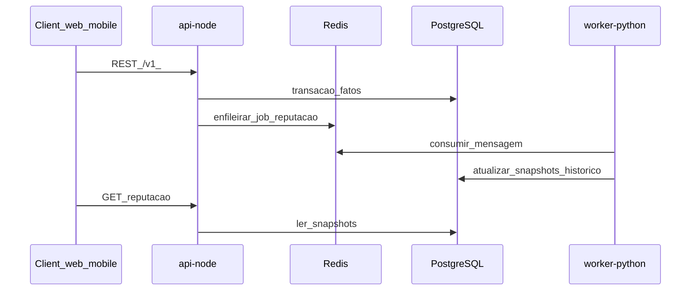

# Padrões de integração

## Objetivo

Definir como **`api-node` (NestJS)** e **`worker-python` (FastAPI/workers)** se integram com **PostgreSQL**, **Redis** e **contratos compartilhados**, com foco em filas assíncronas e evolução por versão de payload.

## Visão geral

## Contratos (`packages/shared-types`)

- Definir **DTOs e eventos** em TypeScript como fonte para o ecossistema JS.  
- No Python: modelos Pydantic **espelhando** os campos e `schema_version`.  
- **Obrigatório:** campo `schema_version` (inteiro) em todo payload de fila.

## Fila e orquestração

### Opção recomendada (MVP)

- **Produção de jobs:** `api-node` usando **BullMQ** sobre Redis.  
- **Consumo:** `worker-python` via uma das estratégias:
  - **A)** Consumidor que lê a mesma estrutura Redis compatível com BullMQ (documentar formato), ou  
  - **B)** Pequeno **bridge** (processo Node ou sidecar) que repassa para Stream/lista consumida pelo Python.

### Alternativas

| Alternativa | Prós | Contras |
|-------------|------|---------|
| Redis Streams nativo em ambos | Menos magia | Mais código manual |
| Message broker externo | Entrega forte | Ops + custo |

**Trade-off:** BullMQ acelera o MVP no Node; exige **disciplina de contrato** para o Python não depender de detalhes internos não documentados.

## Idempotência

- Toda mensagem deve carregar `job_id` ou deduplicação por `(event_type, entity_id, version)`.  
- Worker deve tratar reprocessamento sem duplicar linhas de histórico (upsert ou partição lógica).

## APIs síncronas entre Node e Python

| Abordagem | Quando usar |
|-----------|-------------|
| **Recomendada:** apenas fila + DB compartilhado | Desacoplamento máximo |
| HTTP interno FastAPI ↔ Nest | Operações pontuais na ETAPA 2+ com ADR (ex.: health, ferramentas admin) |

Evitar acoplamento síncrono para **cálculo de reputação** no MVP.

## Erros e reprocessamento

- Falha no worker: retry com backoff; após N tentativas, dead-letter (fila ou tabela) — detalhar na implementação.  
- Falha na API ao enfileirar: transação/outbox (ver [database-standards.md](../07-standards/database-standards.md)).

## Documentação obrigatória ao mudar integração

Atualizar este arquivo + [traceability-matrix.md](../00-governance/traceability-matrix.md) + ADR se impacto for relevante.
