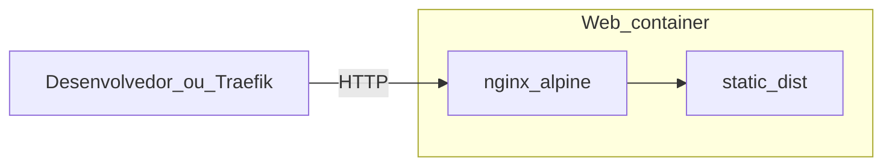
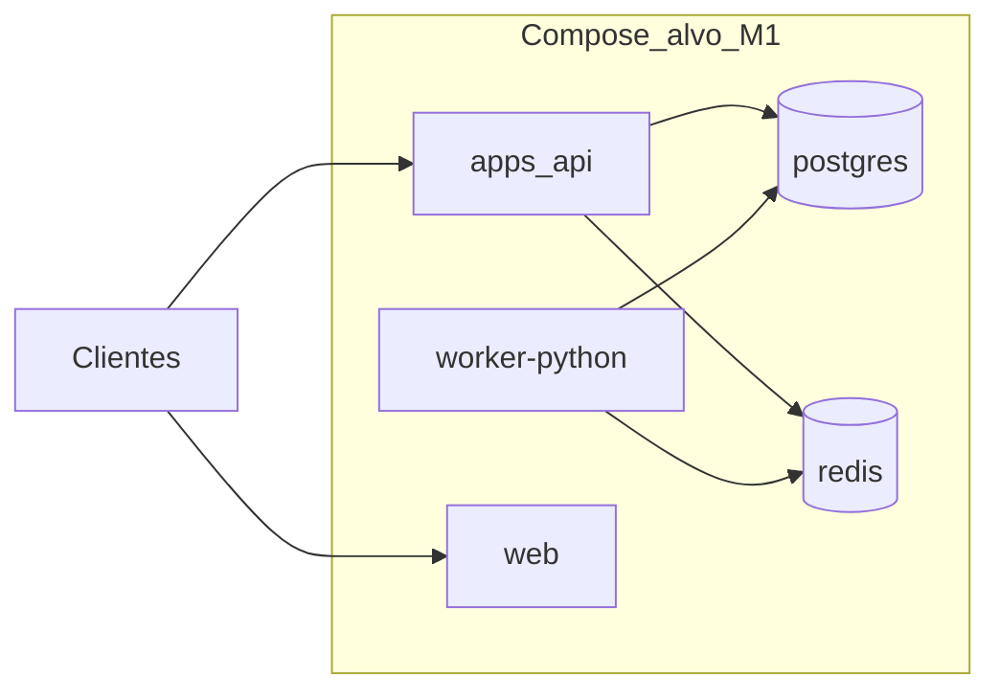

# Visão de deployment

## Objetivo

Descrever a **visão lógica** de deployment (containers, redes, dados) para **desenvolvimento local**, **produção da web** já suportada no repo e **evolução futura** da stack completa, sem amarrar a um provedor cloud específico.

## Web estática — implementado (as-is)

Build multi-stage ([docker/Dockerfile](../../docker/Dockerfile)): dependências npm → `npm run build` em `apps/web` → imagem **Nginx** com `dist/` e SPA fallback.

| Cenário | Ficheiro | Rede / porta |
|---------|----------|----------------|
| **Local** | [docker-compose.yml](../../docker-compose.yml) | Porta host `${WEB_PORT:-8080}` → 80 no container |
| **Produção (Traefik)** | [docker-compose-production.yml](../../docker-compose-production.yml) | Rede Docker externa `gwan`; host público via `GWAN_SOCIAL_HOST` (`.env`); TLS e entrypoint conforme Traefik do ambiente |

**URL base pública da web (produção):** https://social.gwan.com.br/ — alinhada ao valor por omissão de `GWAN_SOCIAL_HOST` em [.env.example](../../.env.example).

Healthcheck HTTP: `GET /health` (Nginx). Variáveis de build: `VITE_*` no `docker build` — ver [environment-strategy.md](environment-strategy.md).

## API Nest — as-is (isolada)

[apps/api/docker-compose.yml](../../apps/api/docker-compose.yml) constrói e expõe **`apps/api`** (imagem `gwan-social-api`). Porta **host** por omissão **`${API_PORT:-4000}`** → **4000** no container (`PORT=4000`).

- **Dados:** feed, posts, perfis e demais leituras vêm de **PostgreSQL** (Prisma); auth JWT e utilizadores na mesma base — `DATABASE_URL`, `JWT_SECRET`, migrations — ver [`apps/api/.env.example`](../../apps/api/.env.example) e [database-schema-physical.md](../03-data-architecture/database-schema-physical.md).

**Checklist ao subir a API em produção:** `DATABASE_URL` e `JWT_SECRET` definidos; `npx prisma migrate deploy`; `CORS_ORIGINS` com a origem HTTPS da SPA; `PUBLIC_API_URL` se a API estiver atrás de proxy. O **compose de produção na raiz** ([`docker-compose-production.yml`](../../docker-compose-production.yml)) publica apenas a **web** — a API deve ser deployada à parte (este compose ou outro serviço).

## Stack completa — alvo ETAPA 2/3 (M1)

| Serviço | Container / processo | Porta (exemplo) |
|---------|----------------------|-----------------|
| `apps/api` | container | **4000** (dev/Docker atual); ajustável por ambiente |
| `worker-python` | container | 8000 (health opcional) |
| `web` | container ou dev server | 5173 (dev) / 80 (prod Nginx) |
| PostgreSQL | container | 5432 |
| Redis | container | 6379 |

**Compose** com API, worker, bases de dados e filas: **planeado** em `infra/docker/` ou consolidação com Compose na raiz — ver [folder-structure.md](../07-standards/folder-structure.md). O Compose **atual** na raiz **não** substitui este alvo; a API sozinha já tem Compose dedicado em `apps/api/`.

## Produção (diretrizes gerais)

- **Stateless** para **`apps/api`** e `worker-python` (escala horizontal), quando existirem.  
- **PostgreSQL** gerenciado ou VM com backup.  
- **Redis** com persistência configurada se a fila exigir durabilidade (avaliar trade-off em ADR).  
- **Segredos** via vault/variáveis do ambiente — nunca no Git.

## Evolução

- **Kubernetes:** quando necessário escalar serviços independentemente; novo ADR para ingress, secrets e migrações.
